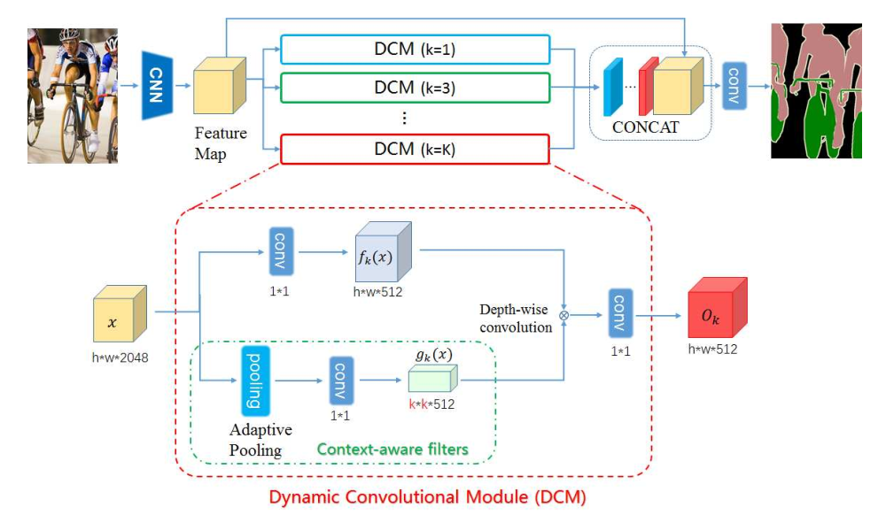

# DMNet_paddle


## 1 简介
  
本项目基于paddlepaddle框架复现了DMNet语义分割模型，DMNet提出动态滤波器，核心在于DCM模块，该模块利用池化和卷积生成动态卷积核，与特征图进行卷积。

**论文：**
- [1] Junjun He, Zhongying Deng, Yu Qiao. [Dynamic Multi-scale Filters for Semantic Segmentation](https://openaccess.thecvf.com/content_ICCV_2019/papers/He_Dynamic_Multi-Scale_Filters_for_Semantic_Segmentation_ICCV_2019_paper.pdf)

**项目参考：**
- [https://github.com/open-mmlab/mmsegmentation/tree/master/configs/dmnet](https://github.com/open-mmlab/mmsegmentation/tree/master/configs/dmnet)

## 2 复现精度
>在CityScapes val数据集的测试效果如下表。


|NetWork |steps|opt|image_size|batch_size|dataset|memory|card|mIou|config|weight|log|
| :---: | :---: | :---: | :---: | :---: | :---: | :---: | :---: | :---: | :---: | :---: | :---: |
|DMNet|80K|SGD|1024x512|8|CityScapes|32G|4|79.88|[dmnet_cityscapes_1024x512_80k.yml](configs/dmnet_cityscapes_1024x512_80k.yml)|[weight](https://bj.bcebos.com/v1/ai-studio-cluster-infinite-task/outputs/105098.tar?authorization=bce-auth-v1%2F0ef6765c1e494918bc0d4c3ca3e5c6d1%2F2021-11-25T02%3A08%3A27Z%2F-1%2F%2F8fd8238db80084be64ea3ae49ddb9ca0f3926a2b0d30dd9f81b5273b4927657a) |[log](log/trainer-0.log)|

## 3 数据集
[CityScapes dataset](https://www.cityscapes-dataset.com/)

- 数据集大小:
    - 训练集: 2975
    - 验证集: 500

## 4 环境依赖
- 硬件: Tesla V100 * 4

- 框架:
    - PaddlePaddle == 2.2.0
  
    
## 快速开始

### 第一步：克隆本项目
```bash
# clone this repo
git clone https://github.com/justld/DMNet_paddle.git
cd DMNet_paddle
```

**安装第三方库**
```bash
pip install -r requirements.txt
```


### 第二步：训练模型
单卡训练：
```bash
python train.py --config configs/dmnet_cityscapes_1024x512_80k.yml  --do_eval --use_vdl --log_iter 100 --save_interval 1000 --save_dir output
```
多卡训练：
```bash
python -m paddle.distributed.launch train.py --config configs/dmnet_cityscapes_1024x512_80k.yml  --do_eval --use_vdl --log_iter 100 --save_interval 1000 --save_dir output
```

### 第三步：测试
output目录下包含已经训练好的模型参数以及对应的日志文件。
```bash
python val.py --config configs/dmnet_cityscapes_1024x512_80k.yml --model_path 
```

### 第四步：test_tipc
output目录下包含已经训练好的模型参数以及对应的日志文件。
```bash
bash test_tipc/prepare.sh ./test_tipc/configs/dmnet_small/train_infer_python.txt 'lite_train_lite_infer'
bash test_tipc/test_train_inference_python.sh ./test_tipc/configs/dmnet_small/train_infer_python.txt 'lite_train_lite_infer'
```

## 5 代码结构与说明
**代码结构**
```
├─configs                          
├─images                         
├─output                           
├─paddleseg                                                   
│  export.py                     
│  predict.py                        
│  README.md                        
│  README_CN.md                     
│  requirements.txt                      
│  setup.py                   
│  train.py                
│  val.py                       
```
**说明**

1、本项目在Aistudio平台，使用Tesla V100 * 4 脚本任务训练100K 79.88%。  
2、本项目基于PaddleSeg开发。  

## 6 注意

DMNet转为静态图模式，需要固定输入尺寸，具体参考[这里](test_tipc/README.md)。

## 7 模型信息

相关信息:

| 信息 | 描述 |
| --- | --- |
| 作者 | 郎督|
| 日期 | 2021年11月 |
| 框架版本 | PaddlePaddle==2.2.0 |
| 应用场景 | 语义分割 |
| 硬件支持 | GPU、CPU |
| 在线体验 | [notebook](https://aistudio.baidu.com/aistudio/projectdetail/3026330?contributionType=1), [Script](https://aistudio.baidu.com/studio/project/partial/verify/2904576/a3f53cc704bb48ed9e439ec82eb2d6e1)|


